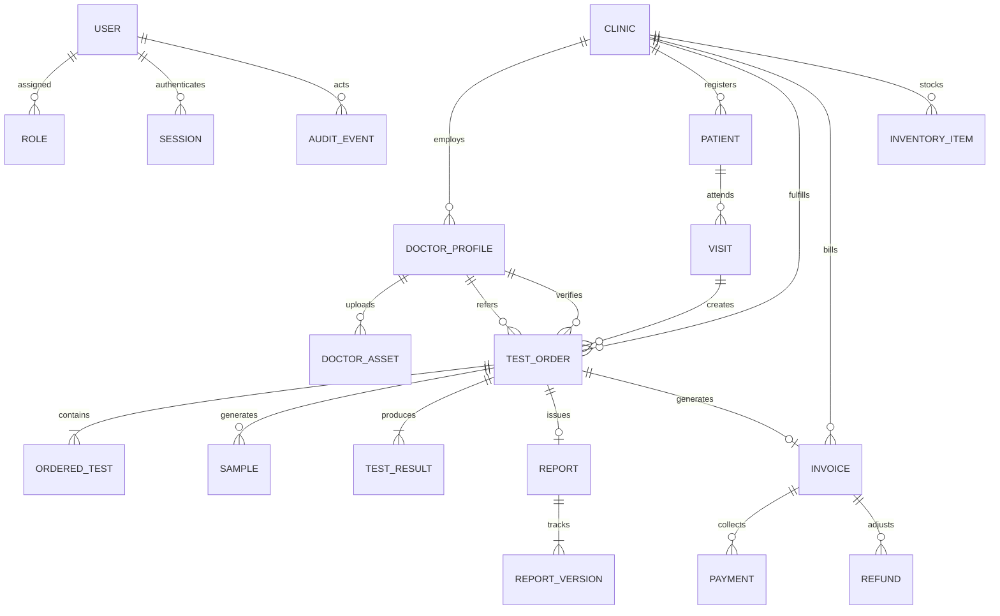

# LabCare Pro - Entity Relationship (ERD) & Data Model Specification

## 1. Entity Overview

## 2. Model Definitions and Indexes

### 2.1 Users & Access Control
- `User`: `{ email, passwordHash, firstName, lastName, phone, roles[], clinics[], isActive, failedLoginAttempts, lockoutUntil, lastLoginAt }`
  - Unique Index: `{ email: 1 }`
  - Index: `{ clinics: 1 }`, `{ isActive: 1 }`
- `Role`: `{ name, description, permissions[], isSystem }`
  - Unique Index: `{ name: 1 }`
- `Session`: `{ tokenHash, userId, clinicId, rememberMe, expiresAt, revokedAt, revokedReason, ipAddress, userAgent }`
  - Unique Index: `{ tokenHash: 1 }`
  - Compound Index: `{ tokenHash: 1, revokedAt: 1, expiresAt: 1 }`
  - TTL Index: `{ expiresAt: 1 }` (automatic document cleanup)
- `AuditEvent`: `{ actorId, actorEmail, actorRole, action, entityType, entityId, clinicId, details, ipAddress, userAgent, createdAt }`
  - Compound Index: `{ action: 1, createdAt: -1 }`
  - Index: `{ createdAt: -1 }`, `{ entityType: 1, entityId: 1 }`

### 2.2 Clinics & Doctors
- `Clinic`: `{ clinicCode, name, branchCode, address, contact, logoKey, letterheadConfig, reportTemplateId, timeZone, isActive }`
  - Unique Index: `{ clinicCode: 1 }`
- `DoctorProfile`: `{ doctorId, userId, fullName, qualification, specialization, medicalRegistrationNumber, contact, associatedClinics[], isReferringDoctor, isVerifyingDoctor, signatureAssetId, stampAssetId, logoAssetId, letterheadAssetId, parchiAssetId, reportFooterText, isActive }`
  - Unique Index: `{ doctorId: 1 }`
  - Compound Index: `{ associatedClinics: 1, isActive: 1 }`
- `DoctorAsset`: `{ doctorId, assetType, storageKey, originalFilename, mimeType, fileSizeBytes, isApproved, approvedBy, approvedAt, isActive }`
  - Compound Index: `{ doctorId: 1, assetType: 1, isActive: 1 }`

### 2.3 Patients & Clinical Orders
- `Patient`: `{ patientId, registrationNumber, fullName, dateOfBirth, ageYears, ageMonths, gender, phone, email, address, emergencyContact, clinicId, defaultReferringDoctorId, consentAcknowledged, isActive }`
  - Unique Indexes: `{ patientId: 1 }`, `{ registrationNumber: 1 }`
  - Compound Indexes: `{ phone: 1, clinicId: 1 }`, `{ clinicId: 1, createdAt: -1 }`
- `TestOrder`: `{ orderId, orderBarcode, patientId, visitId, clinicId, referringDoctorId, verifyingDoctorId, status, priority, tests[], packages[], pricing, statusHistory[] }`
  - Unique Indexes: `{ orderId: 1 }`, `{ orderBarcode: 1 }`
  - Compound Index: `{ clinicId: 1, status: 1, createdAt: -1 }`
- `Sample`: `{ sampleBarcode, orderId, patientId, clinicId, specimenType, status, collectedBy, collectedAt, receivedBy, receivedAt, rejectionReason, recollectionReason }`
  - Unique Index: `{ sampleBarcode: 1 }`
  - Compound Index: `{ orderId: 1, status: 1 }`
- `TestResult`: `{ orderId, testId, patientId, clinicId, status, parameterResults[], remarks, enteredBy, enteredAt, verifiedBy, verifiedAt, revisions[] }`
  - Unique Compound Index: `{ orderId: 1, testId: 1 }`
- `Report`: `{ reportId, orderId, patientId, clinicId, verifyingDoctorId, status, currentVersion, storageKeyPdf, storageKeyDocx, brandingSnapshot, signerSnapshot, testResultsSnapshot[], versions[] }`
  - Unique Indexes: `{ reportId: 1 }`, `{ orderId: 1 }`
  - Compound Index: `{ patientId: 1, status: 1 }`

### 2.4 Billing, Inventory & Notifications
- `Invoice`: `{ invoiceNumber, orderId, patientId, clinicId, items[], subtotal, discountPercent, discountAmount, netTotal, paidAmount, balanceDue, status }`
  - Unique Index: `{ invoiceNumber: 1 }`
- `Payment`: `{ receiptNumber, invoiceId, orderId, patientId, clinicId, amount, paymentMethod, transactionReference, receivedBy, idempotencyKey }`
  - Unique Index: `{ receiptNumber: 1 }`
  - Sparse Unique Index: `{ idempotencyKey: 1 }`
- `InventoryItem`: `{ itemCode, name, category, unit, currentStock, minimumThreshold, clinicId, supplierName, lotNumber, expiryDate, isActive }`
  - Unique Index: `{ itemCode: 1 }`
  - Compound Index: `{ clinicId: 1, currentStock: 1 }`
